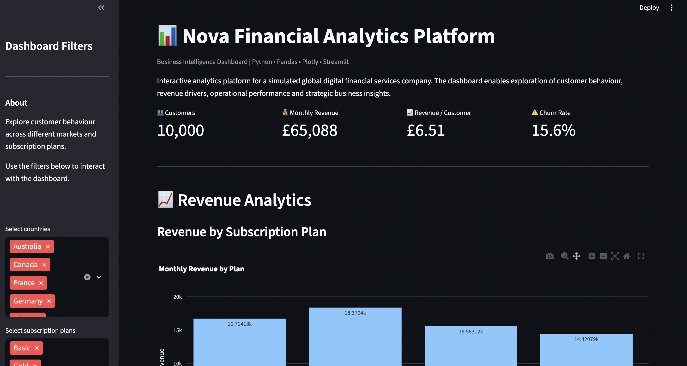

# Customer-Analytics-Dashboard

An interactive Business Intelligence dashboard built with Python to analyse customer behaviour, revenue performance, churn, and operational KPIs for a simulated global digital financial services company.

---

## Features

- Interactive Streamlit dashboard
- Customer segmentation
- Revenue analytics
- Geographic performance analysis
- Churn analysis
- Executive KPI dashboard
- Scenario simulator for business decisions

---

## Tech Stack

- Python
- Pandas
- Plotly
- Streamlit
- NumPy

---

## Business Problem

Digital financial companies need to understand:

- Which customers generate the most revenue?
- Which subscription plans perform best?
- Which markets have the highest value?
- How does churn impact revenue?
- What strategic actions should management take?

This project demonstrates how business analytics can support these decisions.

---

## Future Improvements

- Customer Lifetime Value model
- Predictive churn model
- Machine Learning segmentation
- SQL database integration
- Live API support
